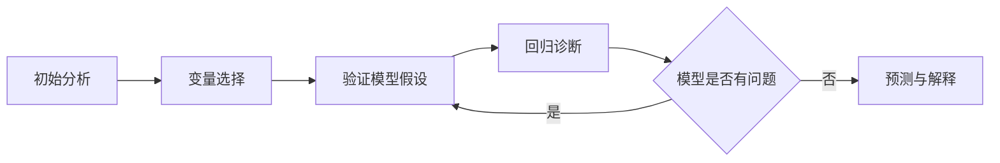

## 回归分析

> 回归模型简介

|中文名称    |英文名称    |描述           |优化公式          |一般用途|
|-----------|-----------|-------------------|----|----|
|最小二乘回归|OLS|Ordinary least squares Linear Regression.|||
||Ridge|Linear least squares with l2 regularization.|||
||SGDRegressor|Linear model fitted by minimizing a regularized empirical loss with SGD.|||
||ElasticNet|Linear regression with combined L1 and L2 priors as regularizer.|||
||Lars|Least Angle Regression model a.k.a.|||
||Lasso|Linear Model trained with L1 prior as regularizer (aka the Lasso)|||

> OLS回归一般流程



### 普通最小二乘

**这部分主要总结介绍回归建模一般步骤与方法，相关回归诊断理论分析，在下面的理论分析部分。**

> 方法介绍

```python
Class: LinearRegression(
    # 线性回归方法
    # 数据
    data: [DataFrame] 
    # 在数据集DataFrame中的名称
    y_name: [str] y 
    # 对给定的列取对数，可以是list给定列名称，
    # 也可以是字符串:
    #    'all', 全部取对数
    #    'endog', 因变量(y)取对数
    #    'exdog', 自变量(X)取对数
    log_cols: [str, list] 
    # 估计方式 'ols' 普通最小二乘 or 'rlm' Robust lm
    estimate: [str] 
)
```

> 示例 - 普通最小二乘回归OLS

```python
# 示例数据
from kivi import LoadData

load_data = LoadData()
crime_data = load_data.CrimeData()
```

**Result:**

| state      |   violent |   hs_grad |   poverty |   single |   white |   urban |
|:-----------|----------:|----------:|----------:|---------:|--------:|--------:|
| Alabama    |     459.9 |      82.1 |      17.5 |     29   |    70   |   48.65 |
| Alaska     |     632.6 |      91.4 |       9   |     25.5 |    68.3 |   44.46 |
| Arizona    |     423.2 |      84.2 |      16.5 |     25.7 |    80   |   80.07 |
| Arkansas   |     530.3 |      82.4 |      18.8 |     26.3 |    78.4 |   39.54 |
| California |     473.4 |      80.6 |      14.2 |     27.8 |    62.7 |   89.73 |

```python
# 进行线性拟合
from kivi.Model import LinearRegression

lr = LinearRegression(crime_data, y_name='murder')

# 打印回归结果
print(lr.res.summary())
```

**Result:**

```markdown
                            OLS Regression Results                            
==============================================================================
Dep. Variable:                 murder   R-squared:                       0.882
Model:                            OLS   Adj. R-squared:                  0.866
Method:                 Least Squares   F-statistic:                     54.91
Date:                Wed, 19 Feb 2020   Prob (F-statistic):           8.02e-19
Time:                        15:48:38   Log-Likelihood:                -83.303
No. Observations:                  51   AIC:                             180.6
Df Residuals:                      44   BIC:                             194.1
Df Model:                           6                                         
Covariance Type:            nonrobust                                         
==============================================================================
                 coef    std err          t      P>|t|      [0.025      0.975]
------------------------------------------------------------------------------
const        -32.9319     10.523     -3.130      0.003     -54.139     -11.725
violent        0.0077      0.002      4.817      0.000       0.004       0.011
hs_grad        0.2047      0.097      2.106      0.041       0.009       0.401
poverty        0.2989      0.118      2.540      0.015       0.062       0.536
single         0.4358      0.098      4.463      0.000       0.239       0.633
white          0.0238      0.023      1.056      0.297      -0.022       0.069
urban         -0.0018      0.013     -0.139      0.890      -0.028       0.024
==============================================================================
Omnibus:                        1.547   Durbin-Watson:                   2.494
Prob(Omnibus):                  0.461   Jarque-Bera (JB):                0.809
Skew:                           0.251   Prob(JB):                        0.667
Kurtosis:                       3.358   Cond. No.                     2.68e+04
==============================================================================

`Warnings`:
[1] Standard Errors assume that the covariance matrix of the errors is correctly specified.
[2] The condition number is large, 2.68e+04. This might indicate that there are
strong multicollinearity or other numerical problems.
```

> 示例 - OLS 模型参数

```python
# 模型拟合参数
print('Parameters: ', lr.res.params)
>>>
    |         |            0 |
    |:--------|-------------:|
    | const   | -32.9319     |
    | violent |   0.00773022 |
    | hs_grad |   0.204742   |
    | poverty |   0.298897   |
    | single  |   0.435815   |
    | white   |   0.0237816  |
    | urban   |  -0.00178929 |

# R^2
print('R2: ', lr.res.rsquared)
>>> 0.8821788029264949

# 标准差
print('Standard errors: ', lr.res.bse)
>>>
    |         |           0 |
    |:--------|------------:|
    | const   | 10.5228     |
    | violent |  0.00160494 |
    | hs_grad |  0.0972317  |
    | poverty |  0.117693   |
    | single  |  0.0976493  |
    | white   |  0.022521   |
    | urban   |  0.0128279  |

# 预测值
print('Predicted values: ', lr.res.predict())
>>> [ 6.87952618  6.01971971  5.47029354  6.91308801  4.92032201  3.04338139
  2.96549525  6.7928318  22.48865498  6.98670125  ...]

...
# 其他参数请使用lr.res."Shift+Tab"查看。
```

> 方法 - 回归诊断

```python
# 共线性: VIF | 条件数
print(lr.vif_value)
print(lr.cond_num)

# 残差正态性
print(lr.residuals_norm_test)

# 异方差
print(lr.heteroske_test)

# 线性性
print(lr.linearity_test)

# 影响测试 - 针对异常值
print(lr.influence(lr.res))

# leverage statistics vs. normalized residuals squared - 针对异常值
lr.plot_leverage_resid2(lr.res)
```

> 示例 - OLS 回归诊断

```python
# 方差膨胀因子 vif
lr.vif_value
>>>{
    'violent': 14.305089857169353,
    'hs_grad': 196.48822505813732,
    'poverty': 45.52237732444601,
    'single': 158.53215210887907,
    'white': 85.56770361098305,
    'urban': 15.612765458337895
}

# 条件数
lr.cond_num
>>> 305.6095363246401

# 残差正态性检验
lr.residuals_norm_test
>>>
    {
        'Jarque-Bera': [('Jarque-Bera', 0.8093166627589925),
                        ('Chi^2 two-tail prob.', 0.6672047348403675),
                        ('Skew', 0.25148840048392296),
                        ('Kurtosis', 3.3575880839877508)],
        'Omni': [('Chi^2 score', 1.5467104876147588),
                 ('Two-tail probability', 0.4614621498907301)]
}

# 异方差
lr.heteroske_test
>>>
    {
        'Breush-Pagan': [('Lagrange multiplier statistic', 16.182213547136072),
                          ('p-value', 0.012808659956129832),
                          ('f-value', 3.408302999760919),
                          ('f p-value', 0.0075423318024658795)],
        'Goldfeld-Quandt': [('F statistic', 0.44695800989048784),
                            ('p-value', 0.9531276340571405)]}

# 线性性测试
lr.linearity_test
>>> [('t value', nan), ('p value', nan)]

# 影响测试
lr.influence_test
>>> 
    | state      |   dfb_const |   dfb_violent |   dfb_hs_grad |   dfb_poverty |   dfb_single |    dfb_white |   dfb_urban |     cooks_d |   standard_resid |   hat_diag |   dffits_internal |   student_resid |      dffits |
    |:-----------|------------:|--------------:|--------------:|--------------:|-------------:|-------------:|------------:|------------:|-----------------:|-----------:|------------------:|----------------:|------------:|
    | Alabama    |   0.0227873 |   -0.00779274 |   -0.0248239  |   -0.00841207 |   0.00874497 | -0.00579943  | -0.0229824  | 0.000386988 |        0.172606  |  0.0833467 |        0.0520473  |        0.170691 |  0.0514698  |
    | Alaska     |  -0.457218  |   -0.908514   |    0.23347    |    0.909002   |   0.169231   |  0.354372    |  1.07609    | 0.324969    |       -2.47503   |  0.270789  |       -1.50824    |       -2.6372   | -1.60706    |
    | Arizona    |  -0.001564  |   -0.00109371 |    0.00103174 |    0.00451991 |  -0.00162686 |  0.000679803 |  0.00583248 | 8.43121e-06 |        0.0234327 |  0.0970526 |        0.00768235 |        0.023165 |  0.00759459 |
    | Arkansas   |  -0.065641  |   -0.0747424  |    0.0602794  |   -0.023975   |   0.0668172  |  0.0250836   |  0.0618971  | 0.00431609  |       -0.48784   |  0.11265   |       -0.173818   |       -0.483574 | -0.172298   |
    | California |   0.136569  |    0.00494529 |   -0.134081   |   -0.0603519  |  -0.050556   | -0.0526667   |  0.0242819  | 0.00501404  |        0.397479  |  0.181773  |        0.187345   |        0.393644 |  0.185538   |

# Plot leverage statistics vs. normalized residuals squared
lr.plot_leverage_resid2(lr.res)
```

### RLM回归

> 异常值和影响测试 - Robust Regression, RLM回归

- 在线性性的模型假设之下，残差较大的观测值和对回归估计值具有较大影响的观测值，会对模型的拟合造成较大的影响。
稳健回归RLM可以异常健壮的方式进行异常识别及估计。RLM的优点是，即使有许多离群值，估计结果也不会受到很大影响，

```python
# 在 LinearRegression 方法中增加参数 estimate='rlm'
lr = LinearRegression(crime_data, y_name='murder', estimate='rlm')
print(lr.res.summary())
```

**Result: RLM回归**

```markdown
                    Robust linear Model Regression Results                    
==============================================================================
Dep. Variable:                 murder   No. Observations:                   51
Model:                            RLM   Df Residuals:                       44
Method:                          IRLS   Df Model:                            6
Norm:                          HuberT                                         
Scale Est.:                       mad                                         
Cov Type:                          H1                                         
Date:                Wed, 19 Feb 2020                                         
Time:                        17:11:26                                         
No. Iterations:                    50                                         
==============================================================================
                 coef    std err          z      P>|z|      [0.025      0.975]
------------------------------------------------------------------------------
const        -33.4435      9.527     -3.510      0.000     -52.117     -14.770
violent        0.0088      0.001      6.046      0.000       0.006       0.012
hs_grad        0.2121      0.088      2.409      0.016       0.040       0.385
poverty        0.2498      0.107      2.344      0.019       0.041       0.459
single         0.4358      0.088      4.929      0.000       0.263       0.609
white          0.0291      0.020      1.428      0.153      -0.011       0.069
urban         -0.0062      0.012     -0.537      0.591      -0.029       0.017
==============================================================================

If the model instance has been used for another fit with different fit
parameters, then the fit options might not be the correct ones anymore .
```

**输出RLM回归所使用样本的权重**

```python
# 输出RLM回归所使用样本的权重
lr.res.weights
>>> 
    |    |        0 |
    |---:|---------:|
    |  0 | 1        |
    |  1 | 0.392772 |
    |  2 | 1        |
    |  3 | 1        |
    |  4 | 1        |
    |  5 | 1        |
    |  6 | 1        |
    |  7 | 0.519129 |
    | ...| ...      |
```

> OLS vs. RLM **比较OLS回归与RLM回归**

```python
import pandas as pd
import numpy as np
from kivi import LoadData
from kivi.Model import LinearRegression

# 载入数据
load_data = LoadData()
crime_data = load_data.CrimeData()

# 制造异常值
outlier_point = pd.DataFrame({
    'violent': [1000],
    'murder': [0.5],
})
data = crime_data[['violent', 'murder']].append(outlier_point)

# 回归拟合
lr_1 = LinearRegression(data.copy(), y_name='murder', log_cols='all')
lr_2 = LinearRegression(data.copy(), y_name='murder', estimate='rlm', log_cols='all')

# 绘图
import matplotlib.pyplot as plt

fig, ax = plt.subplots(figsize=(8, 6), dpi=100)
ax.plot(lr_1.exog, lr_1.endog, 'o', label="data")
ax.plot(lr_1.exog, lr_1.res.fittedvalues, 'r--.', label="OLS")
ax.plot(lr_2.exog, lr_2.res.fittedvalues, 'g--.', label="RLM")

ax.scatter(
    np.log(outlier_point.violent),
    np.log(outlier_point.murder),
    marker='*', s=200, c='r',
    label='$outlier\ point$'
)

ax.set_xlabel('y: murder')
ax.set_ylabel('x: violent')
ax.set_title('OLS vs. RLM')
ax.legend()
plt.savefig('olsvsrlm.png', dpi=100)
```


**上图可以看到OLS回归在加入异常点后出现明显偏移，而RLM回归并无明显扰动。**

**Ps: lr 方法中提供一种便捷绘制回归图的方法**

```python
# 传入自变量与回归结果
lr.plot_regression(lr.exog, lr.res)
plt.savefig('regression.png', dpi=100)
```


### Different variable combinations

**对变量进行组合，分别进行`OLS`回归，并返回回归结果。**

> 方法

```python
lr.different_variable_combinations(
    # 变量数目
    features_num: [int],
)

return: (
    # 模型评估指标
    model_index,
    # 变量评估指标 
    variables_index
)
```

> 示例

```python
lr = LinearRegression(crime_data, y_name='murder', log_cols='all')
model_index, variables_index = lr.different_variable_combinations(2)
model_index
>>>
|    | columns                        |   nobs |   rsquared |   rsquared_adj |    f_pvalue |     aic |     bic |      DW |
|---:|:-------------------------------|-------:|-----------:|---------------:|------------:|--------:|--------:|--------:|
|  0 | ('log_violent', 'log_hs_grad') |     51 |   0.770324 |       0.760754 | 4.64279e-16 | 29.9655 | 35.7609 | 2.20589 |
|  1 | ('log_violent', 'log_poverty') |     51 |   0.784267 |       0.775278 | 1.03278e-16 | 26.7715 | 32.5669 | 2.23331 |
|  2 | ('log_violent', 'log_single')  |     51 |   0.779263 |       0.770065 | 1.79067e-16 | 27.9409 | 33.7364 | 2.12264 |
|  3 | ('log_violent', 'log_white')   |     51 |   0.678722 |       0.665336 | 1.46265e-12 | 47.0829 | 52.8784 | 2.19153 |
|  4 | ('log_violent', 'log_urban')   |     51 |   0.690411 |       0.677512 | 6.00959e-13 | 45.1928 | 50.9883 | 2.33259 |
|  5 | ('log_hs_grad', 'log_poverty') |     51 |   0.486729 |       0.465342 | 1.1177e-07  | 70.9763 | 76.7718 | 2.26201 |
|  6 | ('log_hs_grad', 'log_single')  |     51 |   0.71805  |       0.706302 | 6.36973e-14 | 40.4235 | 46.2189 | 2.40898 |
|  7 | ('log_hs_grad', 'log_white')   |     51 |   0.522574 |       0.502681 | 1.96671e-08 | 67.2841 | 73.0796 | 2.05115 |
|  8 | ('log_hs_grad', 'log_urban')   |     51 |   0.483264 |       0.461733 | 1.31358e-07 | 71.3195 | 77.115  | 2.18507 |
|  9 | ('log_poverty', 'log_single')  |     51 |   0.751754 |       0.741411 | 3.00026e-15 | 33.9307 | 39.7261 | 2.58784 |
| 10 | ('log_poverty', 'log_white')   |     51 |   0.514543 |       0.494316 | 2.93507e-08 | 68.1349 | 73.9304 | 2.0597  |
| 11 | ('log_poverty', 'log_urban')   |     51 |   0.543552 |       0.524534 | 6.6893e-09  | 64.9925 | 70.7879 | 2.27987 |
| 12 | ('log_single', 'log_white')    |     51 |   0.717324 |       0.705546 | 6.77531e-14 | 40.5546 | 46.3501 | 2.58456 |
| 13 | ('log_single', 'log_urban')    |     51 |   0.683414 |       0.670223 | 1.02751e-12 | 46.3326 | 52.128  | 2.38713 |
| 14 | ('log_white', 'log_urban')     |     51 |   0.204165 |       0.171005 | 0.00416633  | 93.3443 | 99.1398 | 2.09983 |

variables_index
>>>
|    | group_0     |   pvalues_0 |   vif_0 | group_1     |   pvalues_1 |   vif_1 | group_2     |   pvalues_2 |   vif_2 | group_3     |   pvalues_3 |    vif_3 | group_4     |   pvalues_4 |   vif_4 | group_5     |   pvalues_5 |   vif_5 | group_6     |   pvalues_6 |   vif_6 | group_7     |   pvalues_7 |   vif_7 | group_8     |   pvalues_8 |   vif_8 | group_9     |   pvalues_9 |   vif_9 | group_10    |   pvalues_10 |   vif_10 | group_11    |   pvalues_11 |   vif_11 | group_12   |   pvalues_12 |   vif_12 | group_13   |   pvalues_13 |   vif_13 | group_14   |   pvalues_14 |   vif_14 |
|---:|:------------|------------:|--------:|:------------|------------:|--------:|:------------|------------:|--------:|:------------|------------:|---------:|:------------|------------:|--------:|:------------|------------:|--------:|:------------|------------:|--------:|:------------|------------:|--------:|:------------|------------:|--------:|:------------|------------:|--------:|:------------|-------------:|---------:|:------------|-------------:|---------:|:-----------|-------------:|---------:|:-----------|-------------:|---------:|:-----------|-------------:|---------:|
|  0 | const       | 0.00083415  | nan     | const       | 1.72223e-14 | nan     | const       | 3.06931e-13 |  nan    | const       |   0.0116714 | nan      | const       | 4.41181e-09 |  nan    | const       |  0.00695419 | nan     | const       | 0.172344    | nan     | const       | 1.95357e-08 | nan     | const       | 3.68435e-07 | nan     | const       | 8.74493e-14 | nan     | const       |  0.279485    | nan      | const       |  2.4327e-07  | nan      | const      |  4.26216e-07 |  nan     | const      |  2.88531e-11 |  nan     | const      |    0.0424506 |  nan     |
|  1 | log_violent | 1.04028e-10 | 143.707 | log_violent | 1.64279e-12 | 118.617 | log_violent | 3.29432e-05 |  356.32 | log_violent |   2.263e-11 |  81.1268 | log_violent | 9.65614e-13 |  124.77 | log_hs_grad |  0.00326609 | 115.877 | log_hs_grad | 0.0178732   | 284.862 | log_hs_grad | 3.61683e-07 | 416.094 | log_hs_grad | 2.57674e-07 | 100.145 | log_poverty | 0.00063926  | 167.011 | log_poverty |  5.456e-07   |  92.2599 | log_poverty |  1.22742e-08 |  51.8552 | log_single |  1.01239e-12 |  111.371 | log_single |  1.66023e-12 |  121.992 | log_white  |    0.0141707 |   63.418 |
|  2 | log_hs_grad | 5.30742e-05 | 143.707 | log_poverty | 1.1101e-05  | 118.617 | log_single  | 1.96603e-05 |  356.32 | log_white   |   0.534151  |  81.1268 | log_urban   | 0.142841    |  124.77 | log_poverty |  0.0608495  | 115.877 | log_single  | 1.54944e-08 | 284.862 | log_white   | 0.00836446  | 416.094 | log_urban   | 0.0738901   | 100.145 | log_single  | 4.96615e-11 | 167.011 | log_white   |  0.000775054 |  92.2599 | log_urban   |  0.000161909 |  51.8552 | log_white  |  0.0191657   |  111.371 | log_urban  |  0.746989    |  121.992 | log_urban  |    0.205427  |   63.418 |
```


### 分位数回归 🔨


## ElasticNet 回归 🔨

$$
\frac{1}{2n_{samples}} * ||y - Xw||^2_2 + \alpha * l1_{ratio} * ||w||_{1} + 0.5 \alpha (1 - l1\_{ratio}) ||w||^2_2
$$

## 回归诊断

### 基本诊断参数

- 线性回归拟合优度: 判断系数$R^2$
- 线性回归的显著性检验: 回归系数检验$t-test$，线性关系检验$F-test$

---

### 多重共线性

#### 共线性理论分析

> 多重共线性是使用线性回归算法时经常要面对的一个问题。
在其他算法中，例如决策树和贝叶斯，前者的建模过程是逐步递进，
每次拆分只有一个变量参与，这种建模机制含有抗多重共线性干扰的功能；
后者干脆假定变量之间是相互独立的，因此从表面上看，也没有多重共线性的问题。
但是对于回归算法，不论是一般回归，逻辑回归，或存活分析，
都要同时考虑多个预测因子，因此多重共线性是不可避免需要面对的，
在很多时候，多重共线性是一个普遍的现象。
在构造预测模型时如何处理多重共线性是一个比较微妙的议题。
既不能不加控制，又不能一刀切，认为凡是多重共线性就应该消除。

假设有$k$个自变量的多元线性回归模型: 
$$
\begin{aligned}
y & = \theta_0 + \theta_1 x_1 + ... + \theta_k x_k +\varepsilon \\\\
& = X\theta + \varepsilon \\\\
\varepsilon & = N(0, \sigma^2) \\\\
\hat{\theta} & = (X^T X)^{-1}X^Ty 
\end{aligned}
$$
该求解公式唯一的条件是矩阵$X$是列满秩的，不然会有无穷多解，
当各变量之间存在共线性问题，即各变量之间存在部分线性相关时，例如：
$$x_3 = x_2 + x_1 + \varepsilon$$
易知此时$X$近乎是不满秩的，$X^TX$近乎是奇异的，$X$的最小奇异值会非常小。

---

> **扰动分析**: 对于一个方程或者系统而言，当输入有一个非常微小的扰动时，
希望方程或系统的输出变化也非常微小，如果输出的变化非常大，且不能被控制，
那这个系统的预测就无效了。在矩阵计算中，这叫做扰动分析。

**【扰动分析定理】** 
设非奇异方阵$A$满足方程
$$
Ax = y
$$
它的精确解为 $x^\*$，当$A$存在一个小扰动时，假设$\hat{x}$是新方程的解：
$$
(A+\delta A)\hat{x} = y
$$
可以证明$x^*$的扰动满足：
$$
\frac{||\delta x||}{||\hat{x}||} \le k(A) \frac{||\delta A||}{||A||}
$$
其中$k(A) = ||A^{-1}|| \cdot ||A||$
是非奇异方阵的条件数，且此时矩阵范数等价于矩阵最大的奇异值，
即矩阵的条件数等价于`最大奇异值/最小奇异值`。

可以看到矩阵的条件数越大，扰动就越大，即$x$的求解值会变得非常不准确。
回到上面讲的线性回归问题，容易证明最小二乘法的解满足下面的正定方程：
$$
X^TX\hat{\theta} = X^T y
$$

此时

$$
k(X^TX) = \frac{\lambda_max(X^T X)}{\lambda_max(X^T X)} = \frac{\sigma_{max}^2(X)}{\sigma_{min}^2(X)}
$$

当方程有共线性问题时，$X$的最小特征值非常小，相应的，
上述的条件数会非常大。也就是说机器学习中的共线性问题实际上就是矩阵计算中的条件数问题。

从实际应用的角度:
- 一般若`K<100`，则认为多重共线性的程度很小
- `100<=K<=1000`，则认为存在一般程度上的多重共线性
- `K>1000`，则就认为存在严重的多重共线性

> 方差分析

从统计学的角度来看共线性。可以证明参数$\theta$的协方差矩阵为

$$
Var(\hat{\theta}) = Var(\hat{\theta} - \theta) = Var[(X^TX)^{-1}X^T \varepsilon]
$$

又对任意的常数矩阵A和随机变量x有

$$
Var(Ax) = A \cdot Var(x) \cdot A^T
$$

代入上式即可得

$$
Var(\hat{\theta}) = \sigma^2(X^TX)^{-1}
$$

具体到每个参数，有：

$$
Var(\hat{\theta}_i) = \frac{\sigma^2}{(n-1)Var(x_j)} \cdot \frac{1}{1-R_i^2}
$$

其中$Ri2$是将第i个变量$x_i$作为因变量，其他$k-1$个变量作为自变量进行线性回归获得的$R2$，且令

$$
VIF_i = \frac{1}{1-R_i^2}
$$

为方差膨胀因子(variance inflation factor，VIF)。当$R_i^2 \sim 1$时，
即当第$i$个变量和其他变量之间存在线性关系时，`VIF`趋于无穷大。
所以`VIF`的大小反应了变量的共线性程度。一般地，当`VIF`大于`5`或`10`时，
认为模型存在严重的共线性问题。

> 共线性的影响

同时考虑参数显著性检验的`t`统计量：

$$
t = \frac{\hat{\theta}_i}{std(\hat{\theta}_i)} \sim t(n-k-1)
$$

当存在共线性时，参数的标准差偏大，相应的`t 统计量`会偏小，
这样容易淘汰一些不应淘汰的解释变量，使统计检验的结果失去可靠性。

另外考虑线性回归的残差

$$
\hat{\varepsilon} = y - X\hat{\theta} = M\varepsilon
$$

其中$M$是一个投影矩阵，且满足

$$
M = I - X(X^TX)^{-1}X^T
$$

易证明

$$
||\hat{\varepsilon}||^2_2 = \varepsilon^T M \varepsilon \le ||M||_F^2 \cdot ||\varepsilon||_2^2 = (n-k) ||\varepsilon||^2_2
$$

而矩阵$M$的范数与$X$的条件数毫无关系，
于是可以得出共线性并不影响模型的训练精度。
但是对于泛化精度，由于参数的估计已经不准确啦，
所以泛化误差肯定要差些，具体差多少，很难用公式表示出来。

共线性问题对线性回归模型有如下影响：
- 参数的方差增大；
- 难以区分每个解释变量的单独影响；
- 变量的显著性检验失去意义；
- 回归模型缺乏稳定性。样本的微小扰动都可能带来参数很大的变化；
- 影响模型的泛化误差。

#### 共线性检测方法

- VIF

```python
lr.vif_value
```

- 条件数`condition number`

```python
lr.cond_num
```

- 相关性分析: 检验变量之间的相关系数，参考: [相关系数](./descriptive_statistics/descriptive_statistics?id=相关系数示例)


#### 共线性解决方法

- 从数据的角度
    - 提前筛选变量
    - 最优子集法
- 从模型角度规避
    - PCA 降维法
    - 逐步回归
    - 岭回归、L2正则化
    - LASSO 回归
    - ElasticNet 回归
    - 偏最小二乘 PLS

---

### 异方差

异方差性是相对于同方差而言的。所谓同方差，是为了保证回归参数估计量具有良好的统计性质，
经典线性回归模型的一个重要假定：总体回归函数中的随机误差项满足同方差性，
即它们都有相同的方差。

> 来源

1. 模型中缺少某些解释变量，从而随机扰动项产生系统模式
1. 测量误差
1. 模型函数形式设置不正确
1. 异常值的出现

> 异方差 - 检验方式

```python
lr.heteroske_test
>>>
    {
        'Breush-Pagan': [('Lagrange multiplier statistic', 16.182213547136072),
                          ('p-value', 0.012808659956129832),
                          ('f-value', 3.408302999760919),
                          ('f p-value', 0.0075423318024658795)],
        'Goldfeld-Quandt': [('F statistic', 0.44695800989048784),
                            ('p-value', 0.9531276340571405)]}
```

> 后果:

1. 参数估计量仍然是线性无偏的，但不是有效的；
2. 异方差模型中的方差不再具有最小方差性；
3. `t`检验失去作用；
4. 模型的预测作用遭到破坏。

> 补救措施：

1. 对模型变换，当可以确定异方差的具体形式时，将模型作适当变换有可能消除或减轻异方差的影响。
1. 加权最小二乘法，对原模型变换的方法与加权二乘法实际上是等价的，可以消除异方差。
1. 对数变换，运用对数变换能使测定变量值的尺度缩小。
它可以将两个数值之间原来`10`倍的差异缩小到只有`2`倍的差异。
其次，经过对数变换后的线性模型，其残差 $\varepsilon$ 表示相对误差，
而相对误差往往比绝对误差有较小的差异。

**更多方法请参考: 残差分析 - 方差齐性检验**

---

### 残差分析

**线性回归假设: 残差 $\varepsilon \sim N(0, \sigma^2)$ 独立同分布。**

1. 正态性检验
1. 独立性检验
1. 方差齐性检验

只有以上假设被验证，模型才是成立的。

#### 正态性检验

> 直方图目测: 根据数据分布的直方图与标准正态分布对比进行检验，主要是通过目测。

```python
lr.plot_resid()
plt.savefig('resid.png', dpi=100)
```


> PP or QQ 图

PP图是对比正态分布的累积概率值和实际分布的累积概率值。

```python
lr.plot_pp()
plt.savefig('pp.png', dpi=100)
```


`QQ`图是通过把测试样本数据的分位数与已知分布相比较，
从而来检验数据的分布情况。对应于正态分布的QQ图，
就是由标准正态分布的分位数为横坐标，样本值为纵坐标的散点图。

```python
lr.plot_qq()
plt.savefig('qq.png', dpi=100)
```


pp图和qq图判断标准是：
如果观察点都比较均匀的分布在直线附近，
就可以说明变量近似的服从正态分布，否则不服从正态分布。

> Shapiro检验

假设变量是服从正态分布的，然后对假设进行检验。
一般地数据量低于5000则可以使用Shapiro检验，
大于5000的数据量可以使用K-S检验，
这种方法在scipy库中可以直接调用：

```python
import scipy.stats as stats
stats.shapiro(residual)
```

如果`p`值非常小，远远小于`0.05`，则拒绝原假设，说明残差不服从正态分布。


> Jarque-Bera检验

Jarque-Bera检验基于数据样本的偏度和峰度，评价给定数据服从未知均值和方差正态分布的假设是否成立。

```python
# 残差正态性检验
lr.residuals_norm_test
>>>
    {
        'Jarque-Bera': [('Jarque-Bera', 0.8093166627589925),
                        ('Chi^2 two-tail prob.', 0.6672047348403675),
                        ('Skew', 0.25148840048392296),
                        ('Kurtosis', 3.3575880839877508)],
        'Omni': [('Chi^2 score', 1.5467104876147588),
                 ('Two-tail probability', 0.4614621498907301)]
}
```

#### 独立性检验

残差的独立性可以通过`Durbin-Watson`统计量`DW`来检验。

- 原假设: $p=0$，即前后扰动项不存在相关性
- 背责假设: $p \ne 0$，即近邻的前后扰动项存在相关性

判断标准是：

- $p=0，DW=2$：扰动项完全不相关
- $p=1，DW=0$：扰动项完全正相关
- $p=-1，DW=4$：扰动项完全负相关

**示例**

```python
lr.DW
>>> 2.4939455362349867
```
DW值为2.5，说明残差之间是近似不相关的，基本满足独立性假设。

#### 方差齐性检验

如果残差随着自变量增发生随机变化，上下界基本对称，
无明显自相关，方差为齐性，我们就说这是正常的残差。
判断方差齐性检验的方法一般有两个：

- 图形法
- BP检验

**图形法**
图形法就是画出自变量与残差的散点图，自变量为横坐标，残差为纵坐标。

```python
lr.plot_variance_homogeneity(lr.exog, lr.res.resid)
```

**Result**


图形法可以看出：残差的方差（即观察点相对红色虚线的上下浮动大小）
随着自变量变化有很大的浮动，说明了残差的方差是非齐性的。

如果残差方差不是齐性的，有很多修正的方法，比如加权最小二乘法，稳健回归等，
而最简单的方法就是对`变量取自然对数`。而取对数从业务上来说也是有意义的，
解释变量和被解释变量的表达形式不同，对回归系数的解释也不同。
下面是不同转换情况下的解释：

|模型          |因变量   |自变量    |对$\beta_1$的解释|
|--------------|--------|---------|----------------|
|水平值 - 水平值 |$y$     |$x$      |$\Delta y = \beta_i \Delta x$|
|对数 - 水平值   |$y$     |$log(x)$ |$\Delta y = (\beta_i / 100) \\% \Delta x$|
|水平值 - 对数   |$log(y)$|$x$      |$\\% \Delta y (100 \beta_i) \Delta x$|
|对数 - 对数     |$log(y)$|$log(x)$ |$\\% \Delta y = \beta_i \\% \Delta x$|

**拟合数据对数化**

```python
# 添加参数 log_cols: [str, list]，对给定的列取对数，可以是list给定列名称，
#    也可以是字符串:
#        'all', 全部取对数
#        'endog', 因变量(y)取对数
#        'exdog', 自变量(X)取对数
LinearRegression(crime_data, y_name='murder', log_cols='all')
```

对数转换后的效果可以通过$R^2$或者$修正R^2$的结果比对得出，
如果方差通过取对数变换变成齐性，那么它的$R^2$应该比变换之前数值高，
即会取得更好的效果。

**BP检验**

```python
lr.bp_test()

>>> 
    (0.16586685109032384,
     0.6838114989412791,
     0.1643444790856123,
     0.6856254489662914)
```

- 上述参数：
    - 第一个为：LM统计量值
    - 第二个为：响应的p值，0.68远大于显著性水平0.05，因此接受原假设，即残差方差是一个常数
    - 第三个为：F统计量值，用来检验残差平方项与自变量之间是否独立，如果独立则表明残差方差齐性
    - 第四个为：F统计量对应的p值，也是远大于0.05的，因此进一步验证了残差方差的齐性。
    
---

### 影响测试

> 样本影响检验方法

如果有一些离散点远离大部分数据，那么拟合出来的模型可能就会偏离正常轨迹受到影响。
因此，在做线性回归诊断分析的时候也必须把这些强影响点考虑进去，进行分析。
针对于强影响点分析，一般的有以下几种方法：

1. 学生化残差`SR`: 指残差标准化后的数值。一般的当样本量为几百时，
学生化残差大于`2`的点被视为强影响点，而当样本量为上千时，
学生化残差中大于`3`的点为相对大的影响点。

2. `Cook's D`统计量: 用于测量当第`i`个观测值从分析中去除时，参数估计的改变程度。
一般的`Cook's D`值越大说明越可能是离散点，没有很明确的临界值。
建议的影响临界点是: $Cook's\ D > \frac{4}{n}$，即高于此值可被视为强影响点。

$$
Distance_i = \frac{1}{p+1} \frac{h_{ii}}{1-h_{ii}} r_i^2
$$

3. `DFFITS`统计量: 用于测量第`i`个观测值对预测值的影响。建议的临界值为: $|DFFITS_i|>2\sqrt{\frac{p}{n}}$

4. `DFBETAS`统计量: 用于测量当去除第`i`个观测量时，第`j`个参数估计的变化程度。建议的影响临界值为: $|DFBETAS_{ij}| > 2 \sqrt{\frac{1}{n}}$

> 样本影响检验的实现

1. 以上总体参考指标，请参考: [最小二乘 - 回归诊断](./machine_learning/linearregression?id=普通最小二乘-🔨)
2. 单个指标查看

```python
influence = lr.res.model.get_influence()

leverage = influence.hat_diag_factor
dffits = influence.dffits
resid_stu = influence.resid_studentized_external
cook = influence.cooks_distance
```

> leverage

**leverage**是衡量一个观察值的独立变量值与其他观察值的相距多远的度量。
高杠杆点`(High-leverage points)`是指在独立变量的极值或偏值处进行的那些观测，
因此缺少相邻观测值意味着拟合的回归模型将通过该特定观测值，造成模型拟合偏差。

```python
lr.plot_leverage_resid2(lr.res)
plt.savefig('leverage_resid2.png', dpi=100)
```


绘制`leverage`与标准化残差平方的关系。具有大标准化残差的观测值将在图中标出。

> 解决方案: 请参考[RLM回归](http://localhost:3000/#/./machine_learning/linearregression?id=rlm回归)

### 🔨 线性性

---


- [1] [Leverage (statistics)](https://en.wikipedia.org/wiki/Leverage_(statistics))
- [2] [Regression diagnostic](http://www.statsmodels.org/stable/diagnostic.html)
- [3] [大话线性回归](https://blog.csdn.net/lsxxx2011/article/details/98764818?ops_request_misc=%7B%22request%5Fid%22%3A%22158216255719724845038711%22%2C%22scm%22%3A%2220140713.130056874..%22%7D&request_id=158216255719724845038711&biz_id=0&utm_source=distribute.pc_search_result.none-task)
> Editor&Coding: Chensy

