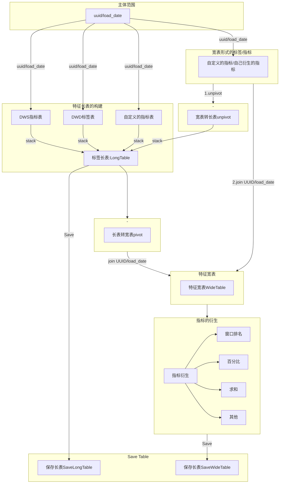

# 数据提取流程及加工规范

----

## 1. 数据提取的基本流程与分析范式

### 1.1 数据的基本提取流程

本节试图总结在数据提取流程上的一般规律，与一般流程。
将数据的提取加工流程梳理为统一流程，规范各数据提取环节，
模块化各关键步骤，增强数据提取代码的可读性，复用性。



注：

*1. 长表一般指的是已经上线在`zj_dws/zj_dwd`中的指标或标签，该数据以指标长表的形式存储；
另外用户自己衍生了一些数据，并以指标长表的表结构存储，该类的数据也可称为指标长表*

*2. 宽表一般指的是`[主键-时间-唯一指标]`的表结构形式，宽表可以由指标长表生成，也可以由数据衍生直接产生。
宽表更方便一般的数据分析与建模工作。*

### 1.2 数据提取流程中的必要环节

> 1. 指标长表构造

```python
from typing import *

def long_table_{project_name}(df_uuid, dates: Optional[Tuple[str], List[str]], tables: List[str], columns: List[str]):
    """ 
    描述：{project_name}长表的构造
    
    1. 引用数据表：
        - zj_dws.t_end_index_xxx
        - zj_dws.....
    2. 生成长表：
        - tmp_work.t_znfk_long_{project_name}
    3. 长表表结构
        - uuid, index_val, index_id, table_src(partition column), load_date(partition column)
    """
    ############################### Option One ###################################
    for load_date in dates:
        for table in tables:
            query = f"""
                SELECT uuid, load_date, index_id, index_val
                WHERE zj_dws.{table}
                    AND index_val IS NOT NULL
                    AND load_date = '{load_date}'
                    AND index_id IN {str(tuple(columns))}       -- option condition
                """
            
            df_index = spark.sql(query)
            df_index = df_index.join(df_uuid, on=['uuid', 'load_date'])
            df_index = df_index.drop('load_date')
            
            InsertIntoHive(
                df_index, 'tmp_work', f't_znfk_long_{project_name}', 
                partition=['table_src', 'load_date'], partition_val=[table, load_date], 
                spark=spark)
    
############################### Option Two ###################################
    start_date, end_date = dates
    for table in tables:
        query = f"""
            SELECT uuid, load_date, index_id, index_val
            WHERE zj_dws.{table}
                AND index_val IS NOT NULL
                AND load_date BETWEEN '{start_date}' AND '{end_date}'
                AND index_id IN {str(tuple(columns))}       -- option condition
            """
        df_index = spark.sql(query)
        df_index = df_index.join(df_uuid, on=['uuid', 'load_date'])
        
        InsertIntoHive(
            df_index, 'tmp_work', f't_znfk_long_{project_name}', 
            partition=['table_src'], partition_val=[table], 
            spark=spark)
    return None
```

> 2. 指标宽表生成

```python
def wide_table_project_name(df_uuid, dates: Optional[Tuple[str], List[str]], tables: List[str], columns: List[str]):
    """
    描述：将指标的长表转换为指标的宽表
    """
    #### 1. 长表较小的情况下，长表可以直接转换为宽表。
    df_long = spark.sql(f"""SELECT * FROM tmp_work.t_znfk_long_{project_name}""")
    df_wide = df_long.groupBy('uuid', 'load_date').piovt('index_id').agg(F.first('index_val'))
    return df_wide
    
    #### 2. 长表较大的情况下，按月份转换为宽表。
    for load_date in dates:
        df_long = spark.sql(f"""
            SELECT uuid, index_val, index_id
            FROM tmp_work.t_znfk_long_{project_name}
            WHERE load_date = '{load_date}'
            """)
        df_wide = df_long.groupBy('uuid').piovt('index_id').agg(F.first('index_val'))
        InsertIntoHive(
            df_wide, 'tmp_work', f't_znfk_wide_{project_name}', 
            partition=['table_src'], partition_val=[table], 
            spark=spark)
```

> 3. 指标的衍生，宽表的保存

```python
def append_index_project_name(df_wide):
    """
    描述：为指标增加衍生
    """
    df_wide = df_wide.withColumn('feature', Operator(*Columns))
    
    ... 
    
    return df_wide
```

### 1.2 数据提取流程细节与规范

#### 1.2 时间处理规范

1. 接受两种时间格式`txn_month/load_date`:
2. data_ranges

#### 1.3 表的存储与读取规范

1. 读取规范
2. 存储规范；表名规范
3. 表提取CSV规范
4. CSV导入Hive
5. 分区规范
6. Hive小文件管理

#### 1.4 脚本文件编写规范

> `.py` 脚本规范，被引用规范
> `.ipynb`文件规范，引用`.py`文件规范

> 表处理

1. 表命名
2. 表保存
   1. pandas.DataFrame to hive
   2. pyspark DataFrame to hive
3. 表提取
4. 分区表

> 数据处理流程

1. 长表
   1. 提取
2. 宽表
   1. 提取，转换
   2. 
3. 衍生

> 算子衍生方式

1. 这里需要定义一些常用的衍生算法，如：排名，分位数，多列求和，其他复合运算
2. 另需注意该算子衍生应于数据开发保持同步。

> 表校验流程

1. 衍生

> jupyter notebook 执行脚本规范

1. 表名：

> .py 脚本规范

> 提取CSV

> 文件与文档保持一致

1. 字段与代码保持一致
2. 统计信息口径与文档保持一致。

> 自定义UDF

1. UDF 输入、输出:udf一对多，一对一，多对一，
2. 空值判断
----

@ chensy edit 20220726
