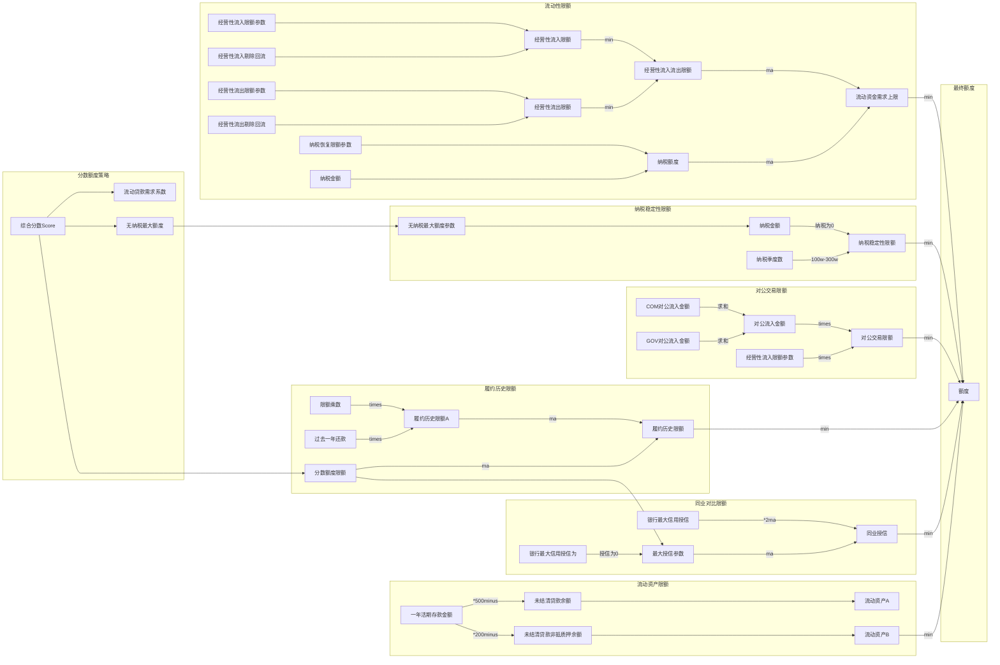

# 额度策略构建

额度策略构建：从小微企业的经营性流入、流出、纳税、历史履约、A卡分数等方 面给出额度限额，
主要有以下三个步骤：

1. 流动资金限额（流入、流出、纳 税）
2. 新增流动资金的空间
3. 纳税稳定性、历史履约、当前杠杆等。

```mermaid
flowchart LR
%% 第一部分：经营流动性限额
subgraph AmountLiquidity [流动性限额]
param_amount_in[经营性流入限额参数] ----> amount_jylred[经营性流入限额]
val_amount_in[经营性流入剔除回流] ----> amount_jylred[经营性流入限额]

param_amount_out[经营性流出限额参数] ----> amount_jylced[经营性流出限额]
val_amount_out[经营性流出剔除回流] ----> amount_jylced[经营性流出限额]

param_tax[纳税恢复限额参数] ----> amount_nsed[纳税额度]
val_tax[纳税金额] ----> amount_nsed[纳税额度]

amount_jylred[经营性流入限额] --min--> amount_min_liqudity[经营性流入流出限额]
amount_jylced[经营性流出限额] --min--> amount_min_liqudity[经营性流入流出限额]

amount_min_liqudity[经营性流入流出限额] --max--> amount_ldzjxqsx[流动资金需求上限]
amount_nsed[纳税额度] --max--> amount_ldzjxqsx[流动资金需求上限]
end

%% 第二部分：纳税稳定性限额
subgraph TaxAmount [纳税稳定性限额]
param_amount_tax_a[无纳税最大额度参数] ----> val_tax_a[纳税金额]
val_tax_a[纳税金额] --纳税为0--> amount_nswdxxe[纳税稳定性限额]
val_tax_quant[纳税季度数] --100w-300w--> amount_nswdxxe[纳税稳定性限额]
end

%% 第三部分：对公交易限额
subgraph TransWithCom [对公交易限额]
val_in_com[COM对公流入金额] --求和--> com_in[对公流入金额]
val_in_gov[GOV对公流入金额] --求和--> com_in[对公流入金额]
com_in[对公流入金额] --times--> amount_dgjyxe[对公交易限额]
param_amount_in_B[经营性流入限额参数] --times--> amount_dgjyxe[对公交易限额]
end

%% 第四部分：履约历史限额
subgraph history_credit [履约历史限额]
param_history_mutil[限额乘数]--times-->amount_history_credit_a[履约历史限额A]
val_history_credit[过去一年还款]--times-->amount_history_credit_a[履约历史限额A]
amount_history_credit_a[履约历史限额A] --max--> amount_history_credit[履约历史限额]
param_max_credit[最大授信参数] --max--> amount_history_credit[履约历史限额]
end

%% 第五部分：同业对比限额
subgraph GuildAmount [同业对比限额]
val_bank_max_credit[银行最大信用授信] --*2max--> amount_guild[同业授信]
val_bank_max_credit_zero[银行最大信用授信为] --授信为0--> param_max_credit_b[最大授信参数]
param_max_credit_b[最大授信参数] --max--> amount_guild[同业授信]
end

%% 第六部分：流动资产
subgraph AssetAmount [流动资产限额]
val_asset[一年活期存款金额] --*500minus--> val_loan[未结清贷款余额]
val_asset[一年活期存款金额] --*200minus--> val_credit_loan[未结清贷款非抵质押余额]
val_loan[未结清贷款余额] ----> amount_asset_a[流动资产A]
val_credit_loan[未结清贷款非抵质押余额] ----> amount_asset_b[流动资产B]
end

subgraph Amount [最终额度]
amount_ldzjxqsx[流动资金需求上限] --min--> amount[额度]
amount_nswdxxe[纳税稳定性限额] --min--> amount[额度]
amount_dgjyxe[对公交易限额] --min--> amount[额度]
amount_history_credit[履约历史限额] --min--> amount[额度]
amount_guild[同业授信] --min--> amount[额度]
amount_asset_b[流动资产B] --min--> amount[额度]
end

%% 分数参数
subgraph SCORE [分数额度策略]
score[综合分数Score] ----> param_total_liquidity[流动贷款需求系数]
score[综合分数Score] ----> param_max_credit[分数额度限额]
score[综合分数Score] ----> param_amount_tax[无纳税最大额度]
param_max_credit[分数额度限额] ----> param_max_credit_b[最大授信参数]
param_amount_tax[无纳税最大额度] ----> param_amount_tax_a[无纳税最大额度参数]
end
```

