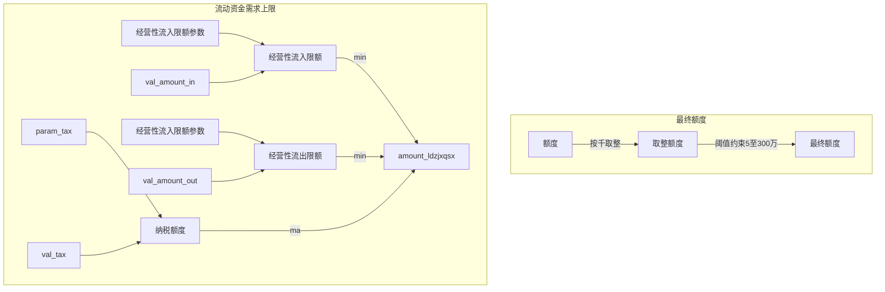

----

### 1. 理论考虑

$$

$$

自身放款能力
风险偏好
客户实际需要
实际经营状况

> 额度模型实现方法

1. 决策树分段预测：决策树回归，决策树分类。
2. softmax回归，额度分段概率。
3. 线性回归，经济含义会比较好。
4. 逻辑回归，

> 额度业务考虑

1. 利率
2. 期限
3. 已用授信
4. 行业
5. 企业规模
6. 企业杠杆率
7. 担保
8. 抵押

> 数据

1. 模型分数
2. 子模型的分数
3. 债务程度

> 当前样本上有的标签

1. 合同金额
2. 利率
3. 期限（可能不准）

> 效果验证

1. 额度的分布与真实数据上的分布的差异；。

#### 2. 实践实现

